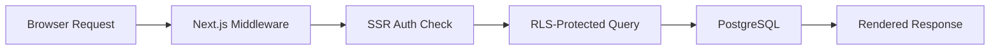
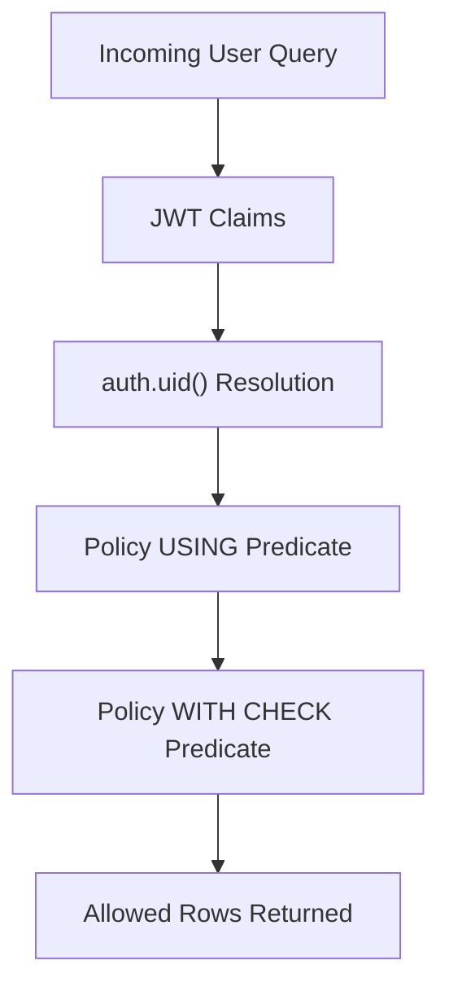
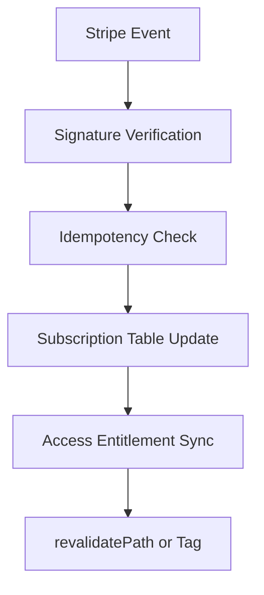
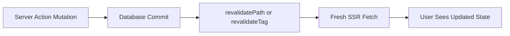

# Next.js + Supabase Production Incidents

**The bugs that appear after you deploy** — indexed by the symptom you see, with the root cause, the fix, and a way to prove the fix works.

**24 incidents** (INC-001 to INC-024) · **11 postmortems** with detection queries · **3 runnable examples** that reproduce 13 of the incidents (5 pgTAP suites, 15 Vitest tests) · **7 checklists** · an RLS audit script.

[Browse incidents](reference/incident-index/README.md) · [Run the examples](examples/README.md) · [Pre-deploy checklists](content/production-checklists/README.md) · [Report an incident](https://github.com/mahdibrr/nextjs-supabase-production-incidents/issues/new?template=incident_report.yml)

> **Building with AI coding tools?** Drop [`AGENTS.md`](AGENTS.md) (and [`.cursor/rules/`](.cursor/rules/nextjs-supabase-production.mdc)) into your repo so Cursor, Copilot, and Claude Code stop generating the RLS, SSR-session, and Stripe-webhook bugs that only surface in production.

## Start from the symptom

| Symptom | Root cause | Fix | Read |
| --- | --- | --- | --- |
| Supabase returns `[]` for rows that exist (INC-002) | RLS is enabled but no `select` policy matches the `authenticated` role; local tests used `service_role`. | Add scoped `select` policies and test as the real authenticated user. | [Postmortem](reference/playbooks/rls-empty-array-postmortem.md) · [pgTAP example](examples/rls-pgtap/README.md) |
| A tenant sees another tenant's rows through Prisma or Drizzle (INC-018) | The ORM connects as `service_role` or `postgres` (`BYPASSRLS`), so policies are never evaluated against the user's JWT. | Use `supabase-js` for tenant-scoped queries, or set the role and `request.jwt.claims` per request. | [Postmortem](reference/playbooks/orm-bypassing-rls-postmortem.md) |
| Private Storage files readable by other users, or uploads return 403 (INC-021) | Public bucket or unscoped `storage.objects` policy; missing `update` policy breaks upserts. | Private bucket, four owner-scoped object policies, short-lived signed URLs issued server-side. | [Postmortem](reference/playbooks/storage-rls-upload-postmortem.md) |
| `revalidatePath` runs but the page still shows old data (INC-008) | The revalidated path or tag does not match the cached fetch, or the segment is static. | Revalidate the exact path or tag tied to the fetch; make user-scoped segments dynamic. | [Postmortem](reference/playbooks/revalidate-stale-postmortem.md) · [Vitest example](examples/nextjs15-cache-and-params/README.md) |
| Build fails or `params.id` is `undefined` after upgrading to Next.js 15 (INC-020) | `params` and `searchParams` are Promises in Next.js 15. | `const { id } = await params;` in every server entry; run the `next-async-request-api` codemod. | [Postmortem](reference/playbooks/nextjs15-async-params-postmortem.md) · [Vitest example](examples/nextjs15-cache-and-params/README.md) |
| `remaining connection slots are reserved…` under load (INC-017) | Serverless fan-out opens more Postgres connections than the pool allows; direct and pooler strings mixed up. | Transaction pooler (6543) at runtime, direct (5432) for migrations only, prepared statements off. | [Postmortem](reference/playbooks/connection-pool-exhaustion-postmortem.md) |
| Stripe webhook returns 200 but subscription state is wrong or duplicated (INC-007, INC-016) | Event IDs deduplicated, but side effects are not idempotent and processing state is not tracked. | Track `received → processing → processed/failed`; return 200 only after side effects commit. | [Test plan](reference/playbooks/stripe-webhook-test-plan.md) · [Vitest example](examples/stripe-webhook-idempotency/README.md) |
| Realtime list is stale, missing or duplicated after the tab was in the background (INC-019) | Background tabs are throttled and Realtime does not backfill changes missed while disconnected. | Resync with a watermarked catch-up query on every (re)subscribe and on `visibilitychange`; dedupe by primary key. | [Postmortem](reference/playbooks/realtime-tab-suspension-postmortem.md) |
| A user opens the app signed in as someone else (INC-022) | A session refresh's `Set-Cookie` response is cached by ISR or a CDN, or a Supabase client is shared across requests. | No ISR on auth routes; apply the `setAll` cache headers (`@supabase/ssr` ≥ 0.10.0); create the client per request. | [Postmortem](reference/playbooks/session-leak-cached-set-cookie-postmortem.md) |
| Server logs warn `getSession() … could be insecure!` (INC-023) | Server code decides identity from a cookie it never verified. | `getClaims()` for identity; `getUser()` where revoked sessions matter. | [Postmortem](reference/playbooks/getsession-server-trust-postmortem.md) |
| `FATAL: Tenant or user not found` after switching to the pooler (INC-024) | Pooler username lacks `.<project-ref>`, or the host was typed instead of copied. | Copy the whole string from the Connect dialog; replace only the password. | [Postmortem](reference/playbooks/pooler-tenant-not-found-postmortem.md) |
| OAuth login loops back to `/login` (INC-004) | The middleware matcher protects `/auth/callback` or the login route. | Exclude callback and login routes from the matcher; verify the cookie write path. | [Incident index](reference/incident-index/README.md) |

All 24 incidents are in the [Production Incident Index](reference/incident-index/README.md). For a broader symptom list grouped by area (auth, RLS, deployment, caching, billing, database, realtime) with links to the official docs, see the [Symptom Reference](content/incidents/README.md).

## What each incident includes

Every entry in the [Incident Index](reference/incident-index/README.md) gives:

- the **problem**, stated as the symptom or error you see;
- the **stack layer** involved (Next.js, Supabase, Stripe, PostgreSQL, ORM);
- the **root cause** and the **fix**;
- a link to a **reusable asset** in this repo: a postmortem, playbook, checklist, SQL script, template or runnable example.

The eleven postmortems in [`reference/playbooks/`](reference/playbooks/) go further. Each has a symptom and impact section, the root cause broken into distinct causes (most with a minimal repro), **detection queries** to run now, the fix, prevention steps (CI gates, review checklist lines), references to the official docs, and a "Last verified" date.

The [runnable examples](examples/README.md) ship the **broken** and the **fixed** implementation side by side, with tests that reproduce the bug and prove the fix.

## Contents

- [Production Flows](#production-flows)
- [Who This Is For](#who-this-is-for)
- [Reference Assets](#reference-assets)
- [Production SaaS Stack](#production-saas-stack)
- [Curated Resources](#curated-resources)
- [Tools and Services](#tools-and-services)
- [Related](#related)
- [Curation Standards](#curation-standards)
- [Contributing](#contributing)

## Production Flows

The four flows where most Next.js + Supabase bugs actually live.

### Request Lifecycle

### RLS Request Flow

### Stripe Webhook Reliability

### Cache Invalidation Flow

## Who This Is For

- Engineers shipping Next.js + Supabase SaaS products to production.
- Teams debugging auth, RLS, billing, and cache invalidation incidents.
- Founders and maintainers who need a reliable architecture baseline.

## Reference Assets

Practical, copy-ready assets maintained in this repo.

| Asset                                                                                              | Use It For                                         |
| -------------------------------------------------------------------------------------------------- | -------------------------------------------------- |
| [Production Incident Index](reference/incident-index/README.md)                                    | Symptom-first incident triage.                     |
| [Debugging Playbook](content/debugging-playbook/README.md)                                         | Auth, RLS, hydration, and API connection fixes.    |
| [Production Checklists](content/production-checklists/README.md)                                   | Release safety gates before deploy.                |
| [Zero-Downtime Rollout Checklist](reference/checklists/zero-downtime-rollout-checklist.md)         | Sequencing a deploy under live traffic.            |
| [RLS Audit SQL](reference/sql/rls-audit.sql)                                                       | Finding policy gaps before they leak data.         |
| [Stripe Webhook Idempotency Template](reference/templates/stripe-webhook-idempotency-template.sql) | Making billing event handling safe to retry.       |
| [Migration Rollback Playbook](reference/playbooks/migration-rollback-playbook.md)                  | Recovering from a failed release.                  |
| [Server Actions Debugging Matrix](reference/playbooks/server-actions-debugging-matrix.md)          | Diagnosing stale UI after a mutation.              |
| [Snippets](content/snippets/README.md)                                                             | Reusable auth, middleware, RLS, and API helpers.   |
| [Open Source Examples](content/open-source-examples/README.md)                                     | Studying real production reference projects.        |
| [Runnable Examples](examples/README.md)                                                            | Run the bug, then watch the fix pass in CI.        |

## Production SaaS Stack

| Layer                  | Typical Choice                           | What It Solves In Production                                        |
| ---------------------- | ---------------------------------------- | ------------------------------------------------------------------- |
| Frontend and rendering | Next.js App Router                       | SSR boundaries, route-level caching, and controlled mutation paths. |
| Auth and sessions      | Supabase Auth + SSR package              | Cookie-based sessions for Server Components and protected routes.   |
| Authorization          | Supabase RLS on PostgreSQL               | Tenant-safe access control at the data layer.                       |
| Billing                | Stripe Billing + webhooks                | Entitlements and subscription lifecycle events.                     |
| Async and workflows    | Supabase Edge Functions + queues         | Background jobs, retries, and side-effect isolation.                |
| AI and search          | pgvector + RAG pipeline                  | Semantic retrieval with controlled indexing and refresh strategy.   |
| Observability          | Sentry + runtime logs + synthetic checks | Error tracing, incident triage, and release confidence.             |
| CI/CD and migrations   | GitHub Actions + migration scripts       | Safe deploy sequencing and schema change discipline.                |

## Curated Resources

### Authentication and Sessions

- [Supabase Auth Quickstart for Next.js](https://supabase.com/docs/guides/auth/quickstarts/nextjs) - Official baseline for App Router auth setup.
- [Supabase Server-Side Auth](https://supabase.com/docs/guides/auth/server-side) - Canonical SSR session and cookie guidance.
- [Supabase SSR Package](https://github.com/supabase/ssr) - Current helpers for server-bound auth flows.
- [Next.js Authentication Guide](https://nextjs.org/docs/app/guides/authentication) - Framework-level auth, session, and authorization patterns.
- [Next.js Environment Variables](https://nextjs.org/docs/app/guides/environment-variables) - Secrets and public key boundaries.

### RLS and Security

- [Supabase Row Level Security](https://supabase.com/docs/guides/database/postgres/row-level-security) - Primary RLS reference.
- [RLS Performance and Best Practices](https://supabase.com/docs/guides/troubleshooting/rls-performance-and-best-practices-Z5Jjwv) - Policy performance and index alignment.
- [Supabase Security Suite](https://supabase.com/blog/hardening-supabase) - Platform-level hardening patterns.
- [Custom Claims and RBAC](https://supabase.com/docs/guides/database/postgres/custom-claims-and-role-based-access-control-rbac) - Role-based access via JWT claims and auth hooks for multi-tenant apps.
- [User Management and Profiles](https://supabase.com/docs/guides/auth/managing-user-data) - Modeling a `public.profiles` table tied to `auth.users` without exposing the auth schema.
- [PostgreSQL EXPLAIN](https://www.postgresql.org/docs/current/using-explain.html) - Query plan analysis for policy-heavy tables.

### Production Debugging

- [Next.js Hydration Error Guide](https://nextjs.org/docs/messages/react-hydration-error) - Root causes and framework-level fixes.
- [Supabase Troubleshooting](https://supabase.com/docs/guides/troubleshooting) - Official issue diagnosis entry point.
- [Chrome DevTools Network Panel](https://developer.chrome.com/docs/devtools/network/) - Request, cookie, and redirect inspection.
- [Vercel Runtime Logs](https://vercel.com/docs/logs/runtime) - Production route and runtime diagnostics.

### Testing

- [Supabase Database Seeding](https://supabase.com/docs/guides/local-development/seeding-your-database) - Populate and reset database state for testing.
- [Next.js Testing Guide](https://nextjs.org/docs/app/guides/testing) - Official guide for testing Next.js applications.
- [Playwright Authentication](https://playwright.dev/docs/auth) - Testing login flows using stored authentication state.
- [Supabase Database Testing (pgTAP)](https://supabase.com/docs/guides/database/testing) - Test RLS policies and database logic using pgTAP with Supabase.

### Server Actions and Revalidation

- [Next.js Server Actions](https://nextjs.org/docs/app/getting-started/mutating-data) - Mutation semantics and runtime behavior.
- [Next.js Caching and Revalidating](https://nextjs.org/docs/app/getting-started/caching-and-revalidating) - Invalidation mechanics and stale-data control.
- [Supabase Auth Redirect Not Working](https://www.iloveblogs.blog/post/supabase-auth-redirect-fix) (maintainer's site) - App Router callback edge cases in production.
- [revalidatePath Debugging Guide](https://www.iloveblogs.blog/post/nextjs-15-caching-explained) (maintainer's site) - Real-world invalidation pitfalls and fixes.

### Stripe and Billing

- [Stripe Webhooks](https://docs.stripe.com/webhooks) - Signature verification and retries.
- [Stripe Launch Checklist](https://docs.stripe.com/get-started/account/checklist) - Go-live billing readiness.
- [stripe-samples/subscription-use-cases](https://github.com/stripe-samples/subscription-use-cases) - Reference subscription implementations.
- [Vercel Subscription Payments](https://github.com/vercel/nextjs-subscription-payments) - Next.js + Supabase + Stripe integration baseline.

### SaaS Architecture and Open-Source Examples

- [SaaS Starter by Next.js](https://github.com/nextjs/saas-starter) - Production-minded starter with billing and data layer foundations.
- [Vercel with-supabase Example](https://github.com/vercel/next.js/tree/canary/examples/with-supabase) - Official integration shape.
- [makerkit/nextjs-saas-starter-kit-lite](https://github.com/makerkit/nextjs-saas-starter-kit-lite) - Maintained open-source SaaS baseline.
- [KolbySisk/next-supabase-stripe-starter](https://github.com/KolbySisk/next-supabase-stripe-starter) - Stripe-driven starter with practical SaaS structure.

### Realtime, Edge Functions, and Background Work

- [Supabase Realtime](https://supabase.com/docs/guides/realtime) - PostgreSQL changes, broadcast, and presence for live features.
- [Supabase Edge Functions](https://supabase.com/docs/guides/functions) - Deno-based serverless functions for webhooks and side effects.
- [Supabase Database Webhooks](https://supabase.com/docs/guides/database/webhooks) - Trigger external workflows from row changes.
- [Supabase Queues](https://supabase.com/docs/guides/queues) - Postgres-native durable message queue for background jobs with guaranteed delivery.
- [Supabase CLI and Local Development](https://supabase.com/docs/guides/local-development/overview) - Local stack, migrations, and seeding.

### AI, RAG, and Agents

- [Supabase AI and Vectors](https://supabase.com/docs/guides/ai) - Official vector and AI workflows.
- [pgvector Extension](https://supabase.com/docs/guides/database/extensions/pgvector) - Storing and querying embeddings in PostgreSQL.
- [Supabase Semantic Search](https://supabase.com/docs/guides/ai/semantic-search) - Embedding-based search with similarity functions and index tuning.
- [Vercel AI SDK](https://ai-sdk.dev/docs/introduction) - TypeScript toolkit for streaming, tool calls, and agents in Next.js.
- [Supabase MCP Server](https://supabase.com/docs/guides/getting-started/mcp) - Connect AI coding tools to your project over the Model Context Protocol.
- [supabase-community/nextjs-openai-doc-search](https://github.com/supabase-community/nextjs-openai-doc-search) - Practical RAG baseline.
- [Vercel AI Chatbot](https://github.com/vercel/chatbot) - Chat architecture reference for Next.js.
- [Production RAG Guide for Next.js and Supabase](https://www.iloveblogs.blog/guides/ai-integration-nextjs-supabase) (maintainer's site) - Operational constraints for retrieval systems.

### CI/CD, Migrations, and Deployment

- [Supabase Database Migrations](https://supabase.com/docs/guides/deployment/database-migrations) - Migration workflow baseline.
- [Generating TypeScript Types](https://supabase.com/docs/guides/api/rest/generating-types) - Schema-to-types safety.
- [GitHub Actions](https://docs.github.com/en/actions) - CI automation backbone.
- [Vercel Next.js Deployment](https://vercel.com/docs/frameworks/nextjs) - Runtime and deploy behavior details.

### Observability and Performance

- [Sentry for Next.js](https://docs.sentry.io/platforms/javascript/guides/nextjs/) - Error monitoring and release correlation.
- [Sentry Tracing](https://docs.sentry.io/platforms/javascript/guides/nextjs/tracing/) - End-to-end latency diagnostics.
- [Checkly](https://www.checklyhq.com/docs/) - Synthetic monitoring for auth and checkout paths.
- [Lighthouse CI](https://github.com/GoogleChrome/lighthouse-ci) - Performance regression detection in CI.

### Learning Paths

- [Next.js Learn Course](https://nextjs.org/learn) - Official guided course for App Router fundamentals.
- [Supabase Next.js Tutorial](https://supabase.com/docs/guides/getting-started/tutorials/with-nextjs) - End-to-end starter from the Supabase team.

## Tools and Services

Decision tables for the choices this stack actually forces. The **baseline** is the default that keeps everything inside Next.js + Supabase; alternatives are listed only when they earn their place with first-class integration.

Paid products carry a pricing marker: **(freemium)** has a free tier, **(paid)** has none. Open-source libraries carry no marker. Affiliations are disclosed, including the maintainer's own.

### Auth

| Option                        | Choose it when                                                                                              |
| ----------------------------- | ----------------------------------------------------------------------------------------------------------- |
| **Supabase Auth** (baseline)  | You want cookie-based SSR sessions wired directly to RLS, no extra vendor.                                  |
| [Clerk](https://clerk.com) (freemium) | You need prebuilt UI, organizations, and MFA out of the box; integrates with Supabase via third-party auth. |
| [Auth.js](https://authjs.dev) | You want framework-native auth with many OAuth providers and full control over the session layer.           |

### Data Access and Type Safety

| Option                                                           | Choose it when                                                                       |
| ---------------------------------------------------------------- | ------------------------------------------------------------------------------------ |
| **supabase-js** (baseline)                                       | You want RLS-aware queries, realtime, and storage from one client.                   |
| [Drizzle ORM](https://supabase.com/docs/guides/database/drizzle) | You want type-safe SQL and migrations, with or instead of the PostgREST Data API.    |
| [Prisma](https://www.prisma.io)                                  | You want a mature schema-first ORM with a large ecosystem against Supabase Postgres. |
| [Kysely](https://kysely.dev)                                     | You want a thin, compile-time-checked SQL query builder with no ORM overhead.        |

### Background Jobs and Workflows

| Option                             | Choose it when                                                                  |
| ---------------------------------- | ------------------------------------------------------------------------------- |
| **Supabase Queues** (baseline)     | You want a Postgres-native durable queue without leaving the database.          |
| [Inngest](https://inngest.com) (freemium) | You want durable multi-step workflows and event-driven jobs deployed on Vercel. |
| [Trigger.dev](https://trigger.dev) (open source, freemium cloud) | You want long-running TypeScript tasks with retries, queues, and observability. |

### Payments and Billing

| Option                    | Choose it when                                                                               |
| ------------------------- | -------------------------------------------------------------------------------------------- |
| **Stripe** (baseline)     | You need full control over subscriptions, metering, and webhook-driven entitlements.         |
| [Polar](https://polar.sh) (paid: fees per transaction) | You want a Merchant of Record that handles tax and invoicing for indie SaaS and AI products. |

### Supporting Tools

| Tool                                                                           | Solves                                                                                   |
| ------------------------------------------------------------------------------ | ---------------------------------------------------------------------------------------- |
| [Resend](https://resend.com) (freemium) | Transactional email from Next.js with React Email templates.                             |
| [Upstash Ratelimit](https://upstash.com/docs/redis/sdks/ratelimit-ts/overview) (freemium) | Connectionless rate limiting for API routes, middleware, and Server Actions.             |
| [t3-env](https://github.com/t3-oss/t3-env)                                     | Type-safe, validated environment variables across server and client boundaries.          |
| [Supabase Self-Hosting](https://supabase.com/docs/guides/self-hosting)         | Running your own Supabase via Docker or Kubernetes.                                      |
| [Coolify](https://coolify.io) (open source, paid cloud) | Self-hostable PaaS for deploying Next.js and a self-hosted Supabase on your own servers. |

## Related

Both are by the maintainer of this repository.

- [dev-error-explainers](https://github.com/mahdibrr/dev-error-explainers) - Deterministic, offline explainers for CORS, ESM/CJS, npm ERESOLVE, ChunkLoadError, `DATABASE_URL` and `next build` errors.
- [iloveblogs.blog tools](https://www.iloveblogs.blog/tools) - Browser tools: paste an error message and get an explanation.

## Curation Standards

- No low-effort list spam.
- No abandoned repos without a clear warning.
- No duplicate links unless they solve different production problems.
- No tutorial-only resources without production applicability.
- No keyword stuffing in descriptions.
- Paid and freemium products are listed only in Tools and Services, with a pricing marker; affiliations are disclosed.

Resources are selected for operational value, not volume.

## Contributing

Pull requests are welcome. See [CONTRIBUTING.md](CONTRIBUTING.md) for format and quality requirements. To add an incident, use the [incident report form](https://github.com/mahdibrr/nextjs-supabase-production-incidents/issues/new?template=incident_report.yml); for broken links or curation gaps, open a PR or an issue.

Help is most needed in RLS incidents, deployment failures, Stripe reliability, Auth edge cases, and monitoring references.

This repository is an independent community resource and is not affiliated with Vercel, Next.js, Supabase, or Stripe.
